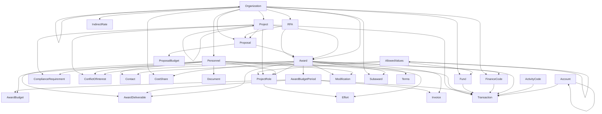

# AI4RA Unified Data Model (UDM)

A universal data model for research administration. The UDM provides a common schema that any institution can adopt to standardize how research administration data is structured, described, and shared — regardless of what systems they use internally.

## Mission

Research administration data is fragmented across institutions, locked in proprietary systems with inconsistent naming, structures, and definitions. The AI4RA UDM aims to:

- **Standardize** the language and structure of research administration data across institutions
- **Be generic enough** to accommodate the diverse needs of universities, research institutes, and funding agencies
- **Enable interoperability** between systems by providing a shared framework that institutions map their local data to
- **Support FAIR data principles** — making research administration data Findable, Accessible, Interoperable, and Reusable

The UDM is a **specification**, not a database. It defines what tables, columns, relationships, and constraints should exist. Institutions implement it in whatever database technology fits their environment and map their local data to the common model.

## How the UDM Is Defined

### Single Source of Truth

The complete UDM is defined in a single file: [`udm_schema.json`](udm_schema.json). This JSON file contains every table, column, data type, constraint, foreign key relationship, description, synonym, and PII flag in the model. It is the authoritative definition from which all other representations (dashboard, API endpoints, documentation) are derived.

### Domain Organization

The model's 29 tables are organized across the major domains of research administration:

| Domain | Tables | Purpose |
|--------|--------|---------|
| **Reference** | Organization, AllowedValues, BudgetCategory | Shared lookup and reference data |
| **Core** | Personnel, ContactDetails, Project | People, contact info, and research projects |
| **Pre-Award** | RFA, Proposal, ProposalBudget | Funding opportunities and proposal development |
| **Post-Award** | Award, Modification, Terms, AwardBudgetPeriod, AwardBudget, Subaward, CostShare, AwardDeliverable | Grant/contract management after funding |
| **Financial** | Fund, Account, FinanceCode, ActivityCode, Transaction, IndirectRate, Invoice | Accounting, transactions, and cost tracking |
| **Personnel & Effort** | ProjectRole, Effort | Roles on projects and effort certification |
| **Compliance** | ComplianceRequirement, ConflictOfInterest | IRB, IACUC, COI, and regulatory tracking |
| **System** | Document, ActivityLog | Document management and audit trails |

The model also includes **8 pre-built views** (e.g., `vw_Active_Awards`, `vw_Budget_Comparison`, `vw_Overdue_Deliverables`) as reference query implementations that institutions can adopt or adapt for dashboards and reporting.

Browse the full model interactively at the [UDM Dashboard](https://ui-insight.github.io/AI4RA-UDM/).

### Naming Conventions (Ontology)

The UDM follows consistent, predictable naming patterns:

- **Tables**: PascalCase — `ProjectRole`, `AwardBudgetPeriod`, `ComplianceRequirement`
- **Columns**: Snake_case — `Award_Number`, `Start_Date`, `Is_Active`
- **Primary keys**: `TableName_ID` — `Personnel_ID`, `Award_ID`, `Organization_ID`
- **Foreign keys**: Named by role, not generically — `Sponsor_Organization_ID`, `Lead_Organization_ID`, `Subrecipient_Organization_ID` (not just `Organization_ID`)
- **Standard suffixes**: `_ID`, `_Date`, `_Status`, `_Type`, `_Amount`, `_Percent`, `_Number`, `_Name`, `_Description`
- **Booleans**: Prefixed with `Is_` — `Is_Active`, `Is_Primary`, `Is_Key_Personnel`

For full ontology documentation, see the [Ontology page](https://ui-insight.github.io/AI4RA-UDM/ontology.html).

### Design Patterns

**Flexible vs. Fixed Enumerations**: The UDM distinguishes between values that vary by institution and values that are universal standards:
- **AllowedValues table** — for institution-specific lookups (contact types, project roles, fund types, deliverable types, etc.) that institutions customize to their needs
- **CHECK constraints** — for universal standards (GAAP account types, federal rate structures, status workflows) that should remain consistent everywhere

See [allowedvalues.md](vignettes/allowedvalues.md) for complete documentation of this pattern.

**Other patterns**: Self-referencing hierarchies (Organization → Parent Organization, Project → Parent Project), referential integrity with CASCADE/SET NULL behaviors, and audit trail support on critical tables.

For a detailed explanation of every table, naming convention, and design decision, see the [Ontology vignette](vignettes/ontology.md).

### JSON Format

The `udm_schema.json` structure:

```json
{
  "tables": {
    "Award": {
      "description": "Funded grants and contracts...",
      "synonyms": "Grant, Contract, Agreement",
      "columns": {
        "Award_ID": {
          "type": "VARCHAR(50)",
          "primary_key": true,
          "required": false,
          "description": "Primary key for award record",
          "synonyms": "Grant ID, Contract ID"
        },
        "Sponsor_Organization_ID": {
          "type": "VARCHAR(50)",
          "references": { "table": "Organization", "column": "Organization_ID" },
          "description": "Organization providing funding"
        }
      }
    }
  },
  "views": {
    "vw_Active_Awards": {
      "description": "Summary of active awards...",
      "sql": "SELECT ..."
    }
  },
  "table_count": 29,
  "view_count": 8,
  "relationship_count": 72
}
```

## Accessing the UDM

The UDM is served as static JSON via GitHub Pages. These endpoints define the **framework** — the structure and conventions of the data model. They do not contain populated data; institutions implement the model and populate it with their own data.

| Endpoint | Description |
|----------|-------------|
| [`/data/udm_schema.json`](https://ui-insight.github.io/AI4RA-UDM/data/udm_schema.json) | Complete schema (SSOT) — tables, columns, types, constraints, descriptions, synonyms, PII flags, views |
| [`/data/data-dictionary.json`](https://ui-insight.github.io/AI4RA-UDM/data/data-dictionary.json) | Human-readable descriptions, synonyms, and PII flags |
| [`/data/relationships.json`](https://ui-insight.github.io/AI4RA-UDM/data/relationships.json) | Foreign key relationships |

Most consumers only need the primary endpoint (`udm_schema.json`) — it contains everything.

```javascript
// Fetch the full UDM schema
const response = await fetch('https://ui-insight.github.io/AI4RA-UDM/data/udm_schema.json');
const udm = await response.json();

// Browse tables
Object.keys(udm.tables);  // ["AllowedValues", "Account", "Award", ...]

// Get a table's columns and descriptions
udm.tables.Award.columns;

// Find all foreign key relationships
for (const [table, data] of Object.entries(udm.tables)) {
  for (const [col, def] of Object.entries(data.columns)) {
    if (def.references) {
      console.log(`${table}.${col} → ${def.references.table}.${def.references.column}`);
    }
  }
}
```

## Implementing the UDM

The UDM is database-agnostic. Institutions can implement it with whatever technology fits their stack:

| Technology | Notes |
|------------|-------|
| **MySQL / MariaDB** | Generate CREATE TABLE statements from `udm_schema.json` table and column definitions |
| **PostgreSQL** | Same approach; adapt types as needed (`VARCHAR` works as-is, adjust date functions) |
| **SQLite** | Good for lightweight/embedded deployments; adapt constraints to SQLite syntax |
| **SQL Server** | Adjust type names (`VARCHAR` → `NVARCHAR`, date functions) |
| **MongoDB / NoSQL** | Use the JSON schema directly as collection definitions; embed related documents where appropriate instead of FK joins |
| **Data Warehouse (Snowflake, BigQuery, Redshift)** | Use as a staging/canonical layer; adapt types to platform-specific variants |

Use `udm_schema.json` as the reference for generating DDL or collection definitions for your target platform. The JSON contains all table structures, column types, constraints, and relationships needed to create a complete implementation.

Institutions are expected to:
1. **Map** their local field names to UDM column names (the `synonyms` field helps identify equivalent concepts)
2. **Populate** the AllowedValues table with their institution-specific lookup values
3. **Adapt** views to their reporting needs

## Contributing

The UDM improves through community input. There are several ways to participate:

- **Suggest changes or report issues**: Open a [GitHub Issue](https://github.com/ui-insight/AI4RA-UDM/issues) describing the table, column, or convention you'd like to add, change, or discuss
- **Join the discussion**: Use [GitHub Discussions](https://github.com/ui-insight/AI4RA-UDM/discussions) for broader questions about the model's direction, new domain coverage, or adoption experiences

When `udm_schema.json` is updated on `main`, CI automatically regenerates the dashboard data files served via GitHub Pages.

<!-- ERD_START -->
## Entity Relationship Diagram


<!-- ERD_END -->
