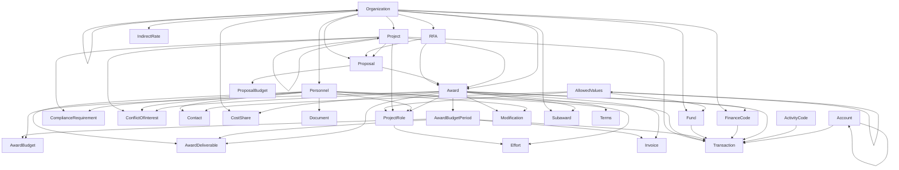

# AI4RA-UDM

A standardized data model for research administration that provides universal terms and definitions, helping institutions map their local data to a common schema for dashboards and analytics.

## Schema Overview

The AI4RA Unified Data Model (UDM) covers all major domains of research administration:

- **Core Entities**: Organization, Personnel, Contact, AllowedValues
- **Project Management**: Project, RFA, Proposal, ProposalBudget
- **Award Management**: Award, Modification, Terms, AwardBudgetPeriod, AwardBudget, Subaward
- **Financial Tracking**: Fund, Account, FinanceCode, ActivityCode, Transaction, IndirectRate
- **Deliverables**: Invoice, AwardDeliverable
- **Personnel & Effort**: ProjectRole, Effort
- **Compliance**: ComplianceRequirement, ConflictOfInterest
- **Documentation**: Document, ActivityLog, DataDictionary

### Naming Conventions

The UDM follows consistent naming conventions throughout the schema:

**Table Names**: PascalCase
- Examples: `AllowedValues`, `ProjectRole`, `ComplianceRequirement`, `AwardBudgetPeriod`
- Multi-word tables use no separators: `AwardDeliverable`, `ConflictOfInterest`

**Column Names**: Snake_case
- Examples: `Allowed_Value_ID`, `Project_ID`, `Is_Active`, `Date_Created`
- Primary keys: `TableName_ID` format (e.g., `Personnel_ID`, `Award_ID`, `Organization_ID`)
- Foreign keys: Match the referenced primary key name (e.g., `Parent_Organization_ID` references `Organization.Organization_ID`)
- Boolean flags: Prefixed with `Is_` (e.g., `Is_Active`, `Is_Primary`)
- Audit fields: `Date_Created`, `Last_Modified_Date`, `Last_Modified_By`, `Created_By_Personnel_ID`

**Rationale**: This mixed approach (PascalCase for tables, Snake_case for columns) is a common and widely-accepted convention in MySQL/Dolt environments. Snake_case for columns provides better readability and case-insensitive matching, while PascalCase for tables clearly distinguishes entity names.

### Key Design Principles

1. **Referential Integrity**: All foreign keys include proper constraints with CASCADE or SET NULL behaviors
2. **Audit Trails**: Timestamps and user tracking on critical tables
3. **Flexible Lookups**: `AllowedValues` table provides configurable controlled vocabularies
4. **Self-Referencing Hierarchies**: Support for organizational and project hierarchies
5. **Comprehensive Financial Tracking**: Detailed budget periods, transactions, and cost tracking
6. **Compliance Support**: Built-in tables for IRB, IACUC, COI, and other regulatory requirements

## Schema Ontology

### Primary Key Naming Convention
All primary keys follow the strict `TableName_ID` format for consistency and ease of joining across tables:
- ProposalBudget: `ProposalBudget_ID`
- Modification: `Modification_ID`
- AwardBudgetPeriod: `AwardBudgetPeriod_ID`
- AwardDeliverable: `AwardDeliverable_ID`
- ProjectRole: `ProjectRole_ID`
- IndirectRate: `IndirectRate_ID`
- ComplianceRequirement: `ComplianceRequirement_ID`
- ConflictOfInterest: `ConflictOfInterest_ID`
- Terms (Award Terms): `AwardTerms_ID`

### Context-Specific Organization References
Organization foreign keys are named based on their role in each context rather than generic `Organization_ID`:
- **Project**: `Lead_Organization_ID` - The primary organization leading the project
- **RFA**: `Sponsor_Organization_ID` - The sponsoring organization issuing the RFA
- **Proposal**:
  - `Sponsor_Organization_ID` - The funding sponsor
  - `Submitting_Organization_ID` - The unit preparing and submitting the proposal
  - `Administering_Organization_ID` - The unit responsible for financial administration
- **Award**:
  - `Sponsor_Organization_ID` - The primary sponsor
  - `Prime_Sponsor_Organization_ID` - The ultimate funding source (for pass-through awards)
- **Subaward**: `Subrecipient_Organization_ID` - The organization receiving the subaward
- **CostShare**: `Source_Organization_ID` - The organization providing cost share
- **IndirectRate**: `Applicable_Organization_ID` - The organization to which the rate applies

### Tables Summary

#### Reference Tables
- **AllowedValues**: Configurable controlled vocabularies for enums throughout the schema
- **BudgetCategory**: Standardized budget categories (Senior Personnel, Equipment, Travel, etc.)
- **Organization**: Organizational units including departments, sponsors, vendors, etc.

#### Core Entities
- **Personnel**: Faculty, staff, students, and external collaborators
- **ContactDetails**: Contact information (email, phone, fax) for Personnel and Organizations
- **Project**: Research projects that may span multiple funding sources

#### Pre-Award
- **RFA**: Request for Applications/Funding Opportunities
- **Proposal**: Grant proposals submitted to sponsors
- **ProposalBudget**: Detailed budget line items by period and category with versioning support

#### Post-Award
- **Award**: Funded grants and contracts
- **Modification**: Award modifications tracking changes, funding, scope, and personnel
- **Terms**: Award terms and conditions including payment methods and reporting requirements
- **AwardBudgetPeriod**: Budget periods for awards
- **AwardBudget**: Detailed award budget line items with approved and current amounts
- **Subaward**: Subawards to other institutions
- **CostShare**: Cost sharing commitments and tracking
- **AwardDeliverable**: Required deliverables and reports

#### Financial Management
- **Fund**: Fund codes for financial tracking
- **Account**: Chart of accounts
- **FinanceCode**: Award-specific finance codes linking to awards
- **ActivityCode**: Activity classification codes
- **Transaction**: Financial transactions across all dimensions
- **IndirectRate**: Indirect cost rates by organization and type
- **Invoice**: Invoices submitted to sponsors

#### Personnel & Effort
- **ProjectRole**: Personnel roles on projects (PI, Co-I, etc.)
- **Effort**: Effort certification and tracking by role and period

#### Compliance
- **ComplianceRequirement**: IRB, IACUC, IBC, and other regulatory approvals
- **ConflictOfInterest**: COI disclosures and management plans

#### System
- **Document**: Document management and versioning
- **ActivityLog**: Audit trail for all database operations

### Views Summary

#### vw_All_ContactDetails
Unified view of all contact details from both Personnel and Organizations, showing entity type, entity name, contact type, and contact value.

#### vw_Active_Awards
Summary of active awards with sponsor information, funding, expenses, encumbrances, available balance, and days until expiration.

#### vw_Active_Personnel_Roles
Current personnel roles on active projects, including project details, role information, FTE percentage, and associated award information.

#### vw_Award_Financial_Summary
Financial summary by award and budget period, showing budgeted amounts, expenses, encumbrances, and available funds.

#### vw_Expiring_Awards
Awards expiring within 90 days, including sponsor information, PI contact details, and days until expiration.

#### vw_Overdue_Deliverables
Deliverables past their due date with days overdue, award information, and responsible person details.

#### vw_ComplianceRequirement_Status
Active compliance requirements with expiration tracking, PI information, and associated project details.

#### vw_Budget_Comparison
Comprehensive budget comparison showing proposed vs. approved vs. current vs. actual spending by award, period, and budget category.

<!-- ERD_START -->
## Entity Relationship Diagram

<!-- ERD_END -->
