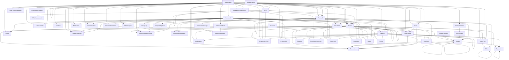

# AI4RA Unified Data Model (UDM)

A universal data model for research administration. The UDM provides a common schema that any institution can adopt to standardize how research administration data is structured, described, and shared — regardless of what systems they use internally.

**Current version: v2.0** (released 2026-06-11). The v1 model is preserved for reference; see [Versions](#versions) below.

## Mission

Research administration data is fragmented across institutions, locked in proprietary systems with inconsistent naming, structures, and definitions. The AI4RA UDM aims to:

- **Standardize** the language and structure of research administration data across institutions
- **Be generic enough** to accommodate the diverse needs of universities, research institutes, and funding agencies
- **Enable interoperability** between systems by providing a shared framework that institutions map their local data to
- **Support FAIR data principles** — making research administration data Findable, Accessible, Interoperable, and Reusable

The UDM is a **specification**, not a database. It defines what tables, columns, relationships, and constraints should exist. Institutions implement it in whatever database technology fits their environment and map their local data to the common model.

## How the UDM Is Defined

### Sources of Truth

The UDM v2 is defined in two complementary artifacts:

- [`vignettes/udm-v2-system-of-record.md`](vignettes/udm-v2-system-of-record.md) — the canonical prose specification: every entity, column, constraint, semantic convention, and design rationale, written database-engine agnostic.
- [`udm_schema_v2.json`](udm_schema_v2.json) — a machine-readable MySQL/MariaDB-dialect serialization of the spec: tables, columns, types, foreign keys, allowed values, PII flags, column synonyms, cross-row constraints, derived-value rules, and example views. Use this to generate DDL, build crosswalk tooling, or feed schema context to LLMs.

The two are kept in exact sync; the prose spec is authoritative on intent, the JSON on machine-consumable detail. An architectural overview lives in [`vignettes/ontology.md`](vignettes/ontology.md), and the version history in [`vignettes/CHANGELOG.md`](vignettes/CHANGELOG.md).

### Domain Organization

The model's 49 tables are organized into six research administration domains, plus two implementation tables:

| Domain | Tables | Purpose |
|--------|--------|---------|
| **Actors** | Personnel, PersonnelCredential, Organization, OrganizationCapability, OrganizationIdentifier, OrganizationRole, ContactDetails | People, organizations, their roles, credentials, and contact information |
| **Funding Cycle** | RFA, RFARequirement, Proposal, ProposalApproval, PreAwardAuthorization, Award, Modification, Subaward, Negotiation, Terms, Report, Closeout, SubmissionProfile, SubmissionPackage, SubmissionAttempt | The full lifecycle from funding opportunity through proposal, award, and closeout |
| **Effort** | AwardRole, Effort | Roles on funded work and effort certification |
| **Money** | Budget, Fund, Account, FinanceCode, Transaction, RateAgreement, IndirectRate, Payment, CostShare, Equipment | Budgets, accounting, transactions, rates, and capital assets |
| **Compliance** | ComplianceRequirement, ComplianceCoverage, ProtocolRole, ConflictOfInterest, OtherSupport, OtherSupportDisclosure | IRB/IACUC protocols, COI, other support, and regulatory tracking |
| **Attachments** | Document, Communication, Restriction, Deadline, Classification, Action, ActivityLog | Supporting records that attach polymorphically to entities across all domains |

**Implementation tables** (not a domain): `AllowedValues` (institution-specific controlled vocabularies with cross-institution canonical codes) and `BudgetCategory` (shared budget category reference). Domains refer to research-administration organizational concepts; these two tables support the model's mechanics.

The model also includes **12 example views** (e.g., `vw_Active_Awards`, `vw_Award_Lineage`, `vw_Overdue_Reports`) as reference query implementations that institutions can adopt or adapt for dashboards and reporting.

Browse the full model interactively at the [UDM Dashboard](https://ui-insight.github.io/AI4RA-UDM/).

### Naming Conventions (Ontology)

The UDM follows consistent, predictable naming patterns:

- **Tables**: PascalCase, singular — `AwardRole`, `ComplianceCoverage`, `Personnel`
- **Columns**: Snake_Case — `Award_Number`, `Start_Date`, `Is_Active`
- **Primary keys**: `TableName_ID` — `Personnel_ID`, `Award_ID`, `Organization_ID` (one deliberate exception: `AllowedValues` uses the singular `AllowedValue_ID`)
- **Foreign keys**: Named by role, not generically — `Sponsor_Organization_ID`, `Administering_Organization_ID`, `Subrecipient_Organization_ID` (not just `Organization_ID`)
- **Standard suffixes**: `_ID`, `_Date`, `_Status`, `_Type`, `_Amount`, `_Percent`, `_Number`, `_Name`, `_Description`
- **Booleans**: Prefixed with `Is_` (`Is_Active`, `Is_Flow_Through`) or a similarly interrogative form (`Subject_To_Federal_Funding`, `Requires_Prior_Approval`)

For full ontology documentation, see [`vignettes/ontology.md`](vignettes/ontology.md).

### Design Patterns

v2 rests on a small set of universal patterns applied consistently across the model:

- **Lifecycle_Stage discriminator** — one table carries a record through its whole life (Budget: Proposed → Approved → Current → Actual; likewise Effort, CostShare, Payment), with revisions chained through `Parent_*_ID`.
- **Two-FK exclusive-or attachment** — satellite tables (Modification, Report, Transaction, Terms, Closeout, and others) attach to either an Award or a Subaward via two nullable FKs, keeping inbound and outbound funding symmetric.
- **Polymorphic attachment** — the seven Attachments tables reference any permitted entity via `Related_Entity_Type` + `Related_Entity_ID`, with documented minimum-conformance enforcement behavior.
- **Flexible vs. fixed enumerations** — institution-specific vocabularies live in the `AllowedValues` table (with `Canonical_Value_Code` for cross-institution normalization); universal standards use CHECK constraints. See [allowedvalues.md](vignettes/allowedvalues.md).
- **Derived columns with recompute triggers** — convenience columns like `Award.Current_End_Date` are documented as derived, with the rules to recompute them.
- **Audit and provenance columns** on every table (`Created_At`, `Updated_At`, `Source_System`, `Source_Record_ID`, `Is_Active`).

For a detailed explanation of every table, pattern, and design decision, see the [prose specification](vignettes/udm-v2-system-of-record.md).

### JSON Format

The `udm_schema_v2.json` structure (abbreviated):

```json
{
  "metadata": {
    "name": "UDM",
    "version": "2.0.0",
    "dialect": "MySQL",
    "spec_source": "vignettes/udm-v2-system-of-record.md",
    "abstract_type_mapping": { "ID": "VARCHAR(50)", "Money": "DECIMAL(15,2)", "...": "..." }
  },
  "domain_membership": { "Actors": ["Personnel", "..."], "...": ["..."] },
  "column_synonyms": { "values": { "Award.Award_Number": "Sponsor Award Number, NoA Number, Grant Number", "...": "..." } },
  "tables": {
    "Award": {
      "domain": "Funding Cycle",
      "description": "Funded agreements...",
      "columns": {
        "Award_ID": { "type": "VARCHAR(50)", "primary_key": true, "required": true, "description": "PK" },
        "Sponsor_Organization_ID": {
          "type": "VARCHAR(50)",
          "references": { "table": "Organization", "column": "Organization_ID" },
          "description": "Organization providing funding"
        }
      }
    }
  },
  "status_taxonomies": { "Award_Status": ["Pending", "Active", "Closing", "Closed", "Suspended", "Terminated"] },
  "cross_row_constraints": [ { "location": "Budget", "rule": "..." } ],
  "derived_values": [ { "table": "Award", "column": "Current_End_Date", "rule": "...", "recompute_triggers": "..." } ],
  "example_views": { "views": [ { "name": "vw_Active_Awards", "sql": "SELECT ..." } ] }
}
```

## Accessing the UDM

The UDM is served as static JSON via GitHub Pages. These endpoints define the **framework** — the structure and conventions of the data model. They do not contain populated data; institutions implement the model and populate it with their own data.

| Endpoint | Description |
|----------|-------------|
| [`/data/udm_schema_v2.json`](https://ui-insight.github.io/AI4RA-UDM/data/udm_schema_v2.json) | **Complete v2 schema (current)** — tables, columns, types, constraints, descriptions, synonyms, PII flags, cross-row constraints, example views |
| [`/data/data-dictionary.json`](https://ui-insight.github.io/AI4RA-UDM/data/data-dictionary.json) | Human-readable descriptions, synonyms, and PII flags |
| [`/data/relationships.json`](https://ui-insight.github.io/AI4RA-UDM/data/relationships.json) | Foreign key relationships |
| [`/data/udm_schema.json`](https://ui-insight.github.io/AI4RA-UDM/data/udm_schema.json) | UDM v1 schema, preserved for reference |

Most consumers only need the primary endpoint (`udm_schema_v2.json`) — it contains everything.

```javascript
// Fetch the full UDM v2 schema
const response = await fetch('https://ui-insight.github.io/AI4RA-UDM/data/udm_schema_v2.json');
const udm = await response.json();

// Browse tables
Object.keys(udm.tables);  // ["Account", "Action", "ActivityLog", ...]

// Get a table's columns and descriptions
udm.tables.Award.columns;

// Find all foreign key relationships
for (const [table, data] of Object.entries(udm.tables)) {
  for (const [col, def] of Object.entries(data.columns)) {
    if (def.references) {
      console.log(`${table}.${col} → ${def.references.table}.${def.references.column}`);
    }
  }
}
```

## Implementing the UDM

The UDM is database-agnostic. The JSON serialization uses MySQL/MariaDB types as its concrete dialect; adapt as needed:

| Technology | Notes |
|------------|-------|
| **MySQL / MariaDB** | Generate CREATE TABLE statements directly from `udm_schema_v2.json` |
| **PostgreSQL** | Same approach; `VARCHAR` works as-is, adjust date functions |
| **SQLite** | Good for lightweight/embedded deployments; adapt constraints to SQLite syntax |
| **SQL Server** | Adjust type names (`VARCHAR` → `NVARCHAR`, date functions) |
| **MongoDB / NoSQL** | Use the JSON schema directly as collection definitions; embed related documents where appropriate instead of FK joins |
| **Data Warehouse (Snowflake, BigQuery, Redshift)** | Use as a staging/canonical layer; adapt types to platform-specific variants |

Institutions are expected to:
1. **Map** their local field names to UDM column names (every column carries a `description`, and the `column_synonyms` sidecar lists common alternate names, to help matchers identify equivalent concepts)
2. **Populate** the AllowedValues table with their institution-specific lookup values, including `Canonical_Value_Code` mappings for cross-institution comparability
3. **Adapt** the example views to their reporting needs

### Crosswalks

A **crosswalk** is a declarative mapping between a source system's vocabulary and the UDM's — one row per source field, listing the target UDM column, any value-translation rules, and transformation notes. Crosswalks are the concrete artifact that operationalizes step 1 above.

| Source Column | UDM Column | Value Translation |
|---------------|------------|-------------------|
| `grantNumber` | `Award.Award_Number` | direct |
| `pi_email` | `ContactDetails.Contact_Value` (with `Contact_Type = "Email"`) | pivot |
| `STATUS_CD = 'A'` | `Award.Award_Status = 'Active'` | enum lookup |
| `proj_start` (MM/DD/YYYY) | `Proposal.Proposed_Start_Date` | parse to DATE |

The UDM supports crosswalk authoring in two places:

- **`column_synonyms`** — a sidecar map of common alternate names for columns, so matchers can identify equivalent concepts without a hand-built dictionary.
- **`description`** on every table and column — plain-language purpose that ML or LLM matchers can use alongside the column name to disambiguate near-duplicates.

In a medallion lakehouse, the crosswalk *is* the Silver layer: each source gets its own Silver schema that renames/pivots/coerces its raw Bronze data into UDM-shaped columns. The Gold layer then unions the Silver views across sources.

See the [Infrastructure tab](https://ui-insight.github.io/AI4RA-UDM/) of the dashboard for diagrams of both the Silver crosswalk layer and the surrounding medallion architecture.

## Versions

| Version | Status | Artifacts |
|---------|--------|-----------|
| **v2.0** | Current | [`udm_schema_v2.json`](udm_schema_v2.json), [prose spec](vignettes/udm-v2-system-of-record.md) |
| v1.0 | Preserved for reference | [`udm_schema.json`](udm_schema.json) |

v2 is a major refactor: 49 tables (from 40), six domains (from ten), unified lifecycle modeling, Award/Subaward symmetry, and rule catalogs for cross-row constraints and semantic conventions. See the [CHANGELOG](vignettes/CHANGELOG.md) for the full delta and migration guidance from v1.

## Contributing

The UDM improves through community input. There are several ways to participate:

- **Suggest changes or report issues**: Open a [GitHub Issue](https://github.com/ui-insight/AI4RA-UDM/issues) describing the table, column, or convention you'd like to add, change, or discuss
- **Join the discussion**: Use [GitHub Discussions](https://github.com/ui-insight/AI4RA-UDM/discussions) for broader questions about the model's direction, new domain coverage, or adoption experiences
- **Take the survey**: A short [practitioner survey](https://bit.ly/4b2ruQ3) on what your institution needs from a shared model

When `udm_schema_v2.json` is updated on `main`, CI automatically regenerates the dashboard data files served via GitHub Pages.

<!-- ERD_START -->
## Entity Relationship Diagram


```mermaid
graph TD

    Account-->FinanceCode
    Account-->Transaction
    AllowedValues-->Action
    AllowedValues-->Award
    AllowedValues-->AwardRole
    AllowedValues-->ComplianceRequirement
    AllowedValues-->ConflictOfInterest
    AllowedValues-->ContactDetails
    AllowedValues-->CostShare
    AllowedValues-->Deadline
    AllowedValues-->Document
    AllowedValues-->FinanceCode
    AllowedValues-->Fund
    AllowedValues-->Modification
    AllowedValues-->OrganizationCapability
    AllowedValues-->OrganizationRole
    AllowedValues-->Proposal
    AllowedValues-->ProtocolRole
    AllowedValues-->RFA
    AllowedValues-->Restriction
    AllowedValues-->Transaction
    Award-->Award
    Award-->AwardRole
    Award-->Budget
    Award-->Closeout
    Award-->ComplianceCoverage
    Award-->ConflictOfInterest
    Award-->CostShare
    Award-->Equipment
    Award-->FinanceCode
    Award-->Modification
    Award-->Negotiation
    Award-->OrganizationRole
    Award-->OtherSupportDisclosure
    Award-->Payment
    Award-->PreAwardAuthorization
    Award-->ProtocolRole
    Award-->Report
    Award-->Subaward
    Award-->Terms
    Award-->Transaction
    AwardRole-->Effort
    Budget-->Budget
    Budget-->Payment
    Budget-->Transaction
    BudgetCategory-->Budget
    ComplianceRequirement-->ComplianceCoverage
    ComplianceRequirement-->ComplianceRequirement
    ComplianceRequirement-->ProtocolRole
    CostShare-->CostShare
    CostShare-->Transaction
    Document-->Action
    Document-->Document
    Document-->Report
    Effort-->Effort
    FinanceCode-->Transaction
    Fund-->FinanceCode
    Fund-->Transaction
    IndirectRate-->Budget
    Organization-->Award
    Organization-->AwardRole
    Organization-->Communication
    Organization-->ComplianceRequirement
    Organization-->ConflictOfInterest
    Organization-->ContactDetails
    Organization-->Equipment
    Organization-->Fund
    Organization-->Negotiation
    Organization-->Organization
    Organization-->OrganizationCapability
    Organization-->OrganizationIdentifier
    Organization-->OrganizationRole
    Organization-->OtherSupport
    Organization-->OtherSupportDisclosure
    Organization-->Personnel
    Organization-->PersonnelCredential
    Organization-->Proposal
    Organization-->RFA
    Organization-->RateAgreement
    Organization-->Subaward
    Organization-->SubmissionProfile
    OtherSupport-->ConflictOfInterest
    OtherSupport-->OtherSupportDisclosure
    Payment-->Payment
    Personnel-->Action
    Personnel-->ActivityLog
    Personnel-->Award
    Personnel-->AwardRole
    Personnel-->Communication
    Personnel-->ConflictOfInterest
    Personnel-->ContactDetails
    Personnel-->Deadline
    Personnel-->Document
    Personnel-->Effort
    Personnel-->Equipment
    Personnel-->Negotiation
    Personnel-->OrganizationRole
    Personnel-->OtherSupport
    Personnel-->PersonnelCredential
    Personnel-->PreAwardAuthorization
    Personnel-->ProposalApproval
    Personnel-->ProtocolRole
    Personnel-->Report
    Personnel-->Restriction
    Personnel-->Subaward
    Proposal-->Award
    Proposal-->Budget
    Proposal-->CostShare
    Proposal-->Negotiation
    Proposal-->OtherSupportDisclosure
    Proposal-->PreAwardAuthorization
    Proposal-->Proposal
    Proposal-->ProposalApproval
    Proposal-->Subaward
    Proposal-->SubmissionPackage
    RFA-->Award
    RFA-->OrganizationRole
    RFA-->Proposal
    RFA-->RFARequirement
    RateAgreement-->IndirectRate
    Subaward-->AwardRole
    Subaward-->Budget
    Subaward-->Closeout
    Subaward-->ComplianceCoverage
    Subaward-->CostShare
    Subaward-->Equipment
    Subaward-->Modification
    Subaward-->Negotiation
    Subaward-->OrganizationRole
    Subaward-->Payment
    Subaward-->ProtocolRole
    Subaward-->Report
    Subaward-->Subaward
    Subaward-->Terms
    Subaward-->Transaction
    SubmissionPackage-->SubmissionAttempt
    SubmissionProfile-->SubmissionAttempt
```
<!-- ERD_END -->
